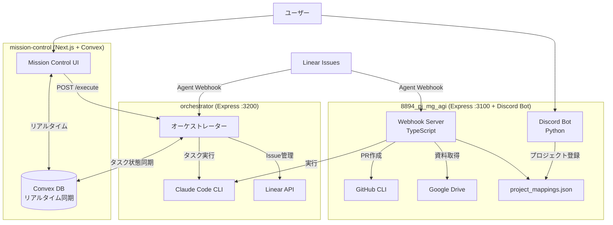

# OpenClaw

mission-control・orchestrator・8894 の3コンポーネントからなる、自律型AIワーカー統合システム。

---

## アーキテクチャ



### コンポーネント概要

| コンポーネント | 技術スタック | 役割 |
|--------------|------------|------|
| **mission-control** | Next.js 16 + Convex + shadcn/ui | 管理ダッシュボード（タスク・カレンダー・メモリ・チーム） |
| **orchestrator** | Express + TypeScript（Port 3200） | mission-control からのタスクを受け取り Claude Code を実行 |
| **8894_pj_mg_agi** | Express + Python Discord Bot（Port 3100） | Linear Webhook → Google Drive → Claude Code → GitHub PR |

---

## セットアップ

### 前提条件

- Node.js >= 18
- Python >= 3.10
- `claude` CLI インストール済み（`claude --version` で確認）
- `gh` CLI（GitHub CLI）インストール済み
- Convex アカウント（[convex.dev](https://convex.dev)）

### 1. mission-control

```bash
cd mission-control
pnpm install

# Convex プロジェクトの初期化
pnpm exec convex dev --once

# .env.local を作成
cp .env.local.example .env.local  # または手動で作成
# NEXT_PUBLIC_CONVEX_URL=https://your-project.convex.cloud
# ANTHROPIC_API_KEY=sk-ant-...

pnpm dev  # http://localhost:3000
```

### 2. orchestrator

```bash
cd orchestrator
npm install

# 環境変数設定
cp .env.example .env
# 必須: CONVEX_URL, LINEAR_ACCESS_TOKEN, ORCHESTRATOR_API_KEY

npm run dev  # http://localhost:3200
```

**`.env` 設定項目（orchestrator）**:

```bash
PORT=3200
CONVEX_URL=https://your-project.convex.cloud
CONVEX_DEPLOY_KEY=your-convex-deploy-key
LINEAR_ACCESS_TOKEN=lin_oauth_xxxxx   # Agent OAuth token (actor=app)
LINEAR_TEAM_ID=your-team-id
CLAUDE_BIN=claude
DEFAULT_REPO_PATH=/path/to/workspace
MAPPING_FILE_PATH=/path/to/project_mappings.json
ORCHESTRATOR_API_KEY=your-api-key
```

### 3. 8894_pj_mg_agi

```bash
cd 8894_pj_mg_agi/claude

# TypeScript サーバー
npm install && npm run build && npm start   # Port 3100

# Discord Bot（別ターミナル）
pip install -r requirements.txt
python3 src/discord_bot/bot.py
```

**`.env` 設定項目（8894）**:

```bash
PORT=3100
LINEAR_ACCESS_TOKEN=lin_oauth_xxxxx
LINEAR_WEBHOOK_SECRET=lin_wh_xxxxx
CLAUDE_BIN=claude
REPO_PATH=/path/to/default/repo
GH_OWNER=your-github-username
WORKSPACE_DIR=/path/to/workspace
GDRIVE_CREDENTIALS_PATH=./oauth_credentials.json
GDRIVE_ROOT_FOLDER_ID=1xxxxxxxxxxxxx
MAPPING_FILE_PATH=./10_raw/project_mappings.json
DISCORD_TOKEN=MTxxxxxxx...
```

---

## API エンドポイント

### orchestrator（Port 3200）

| Method | Path | 認証 | 説明 |
|--------|------|:----:|------|
| `POST` | `/execute` | X-API-Key | タスクを受け取り Claude Code を非同期実行 |
| `POST` | `/webhook/linear` | なし | Linear Agent Webhook 受信（セッション再開） |
| `GET` | `/health` | なし | ヘルスチェック |
| `GET` | `/sessions` | なし | アクティブな Claude Code セッション一覧 |

**`POST /execute` リクエスト例**:

```json
{
  "taskId": "task_123",
  "title": "ログイン機能を実装",
  "description": "JWTを使ったログイン機能",
  "repoPath": "/path/to/repo"
}
```

### 8894_pj_mg_agi（Port 3100）

| Method | Path | 説明 |
|--------|------|------|
| `GET` | `/health` | ヘルスチェック（セッション数・プロジェクト数） |
| `POST` | `/webhook` | Linear Webhook受信（AgentSessionEvent） |
| `GET` | `/sessions` | アクティブな Claude Code セッション一覧 |
| `GET` | `/mappings` | 登録済みプロジェクトマッピング一覧 |

### Discord Bot コマンド（8894）

| コマンド | 説明 |
|---------|------|
| `/set-drive-root folder_id:xxx` | DriveルートフォルダIDを設定・自動マッピング |
| `/map-project project_name:xxx drive_folder_id:xxx github_repo:owner/repo` | プロジェクトを登録 |
| `/list-mappings` | 登録済みマッピング一覧 |
| `/browse-folders folder_id:xxx` | Driveフォルダを閲覧 |
| `/remove-mapping project_name:xxx` | マッピング削除 |
| `/ping` | 接続テスト |

---

## ディレクトリ構造

```
OpenClaw/
├── mission-control/       # Next.js 管理ダッシュボード
│   ├── src/               # React コンポーネント
│   ├── convex/            # DB スキーマ・関数（tasks, agents, schedules 等）
│   └── docs/              # ドキュメント
├── orchestrator/          # Express オーケストレーター（:3200）
│   └── src/
│       ├── routes/        # execute / webhook / status
│       ├── claude/        # Claude Code CLI ラッパー
│       ├── linear/        # Linear GraphQL クライアント
│       ├── services/      # TaskExecutor, ConvexBridge, WorkspaceResolver
│       ├── session/       # セッション管理
│       └── mapping/       # プロジェクトマッピング読み取り
├── 8894_pj_mg_agi/        # Linear + Drive + GitHub 統合（:3100）
│   └── claude/
│       ├── src/           # TypeScript + Python ソース
│       ├── 10_raw/        # project_mappings.json
│       ├── 03_e2e/        # E2Eテスト
│       └── docs/          # ソースコード対応ドキュメント
├── workspace-template/    # OpenClaw ワークスペーステンプレート
├── skill-converter/       # スキル変換ツール
└── docs/                  # プロジェクト全体ドキュメント
```

---

## Linear Issueコマンド（8894）

Issue 説明文または コメントにコマンドを記載し `@agent` をメンション:

| コマンド | 動作 |
|---------|------|
| `project:my-app` | Drive資料DL + リポclone + Claude実行 |
| `select-repo:owner/repo` | 既存リポを選択して Claude 実行 |
| `create-repo:repo-name` | GitHub リポ新規作成 |
| `repo:/path/to/repo` | ローカルパス指定で Claude 実行 |
| （なし） | デフォルトリポで Claude 実行 |

---

## E2Eテスト（8894）

```bash
# サーバー起動済みの状態で
python3 8894_pj_mg_agi/claude/03_e2e/e2e_test_runner.py

# 個別テスト
python3 ... --test server
python3 ... --test webhook
python3 ... --test mapping
```

---

## 参考資料

- [Mission Control 仕様書](docs/mission-control-spec.md)
- [8894 統合システム詳細](8894_pj_mg_agi/claude/README.md)
- [セッションサマリー 2026-02-16](docs/SESSION_SUMMARY_20260216.md)
